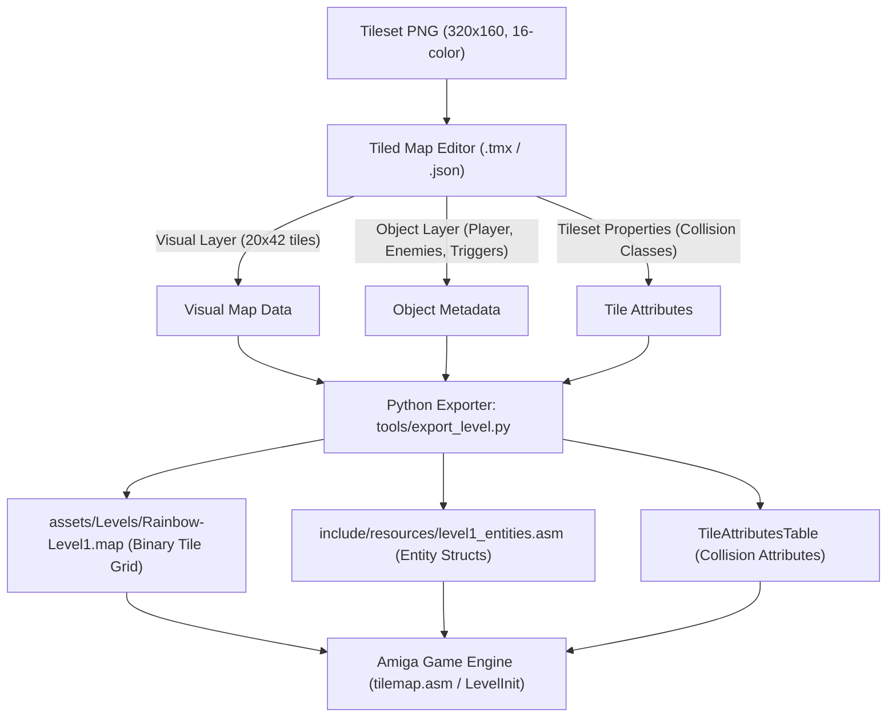

# Tiled Map Editor Guide for Amiga Engine

This document details how to design levels and configure metadata (player start points, enemy spawns, triggers, and physical collision attributes) using **Tiled Map Editor**, and how to convert them into fast binary and assembly files for the Amiga 68000 engine.

- **Reference Tileset**: [Four Seasons Platformer Tileset 16x16 (Itch.io)](https://rottingpixels.itch.io/four-seasons-platformer-tileset-16x16free)

---

## 1. Overview and Architecture



---

## 2. Project Setup in Tiled

### A. Creating the Tileset (`.tsx`)
1. In Tiled, select **File $\rightarrow$ New $\rightarrow$ New Tileset**.
2. Configure the following properties:
   - **Name**: `GameTileset`
   - **Type**: `Based on Tileset Image`
   - **Source Image**: `assets/Tilesets/GameTiles.png` (or 320x160 tileset image)
   - **Tile Width**: `16` px
   - **Tile Height**: `16` px
   - **Margin**: `0` px
   - **Spacing**: `0` px
3. Save as `assets/Levels/GameTileset.tsx`.

### B. Creating the Level Map (`.tmx`)
1. In Tiled, select **File $\rightarrow$ New $\rightarrow$ New Map**.
2. Configure the map geometry:
   - **Orientation**: `Orthogonal`
   - **Tile layer format**: `CSV` (or `Zlib compressed`)
   - **Tile render order**: `Right Down`
   - **Map size**:
     - **Width**: `20` tiles ($20 \times 16 = 320\text{ pixels}$)
     - **Height**: `42` tiles ($42 \times 16 = 672\text{ pixels}$, or custom level height)
   - **Tile size**: `16` px $\times$ `16` px
3. Save as `assets/Levels/Rainbow-Level1.tmx`.

---

## 3. Layer Configuration in Tiled

Your level consists of two primary layers:

### Layer 1: Tile Layer (`Background` / Visuals)
- Place visual tiles from the tileset to create platforms, walls, background art, and ladders.

### Layer 2: Object Layer (`Entities` / Metadata)
Create an **Object Layer** named `Entities` (**Layer $\rightarrow$ New $\rightarrow$ Object Layer**).

Use point markers, rectangles, and custom properties to define gameplay elements:

| Object Type | Tiled Shape | Custom Properties | Purpose |
| :--- | :--- | :--- | :--- |
| **`PlayerStart`** | Point Marker | `direction` (0=Left, 1=Right) | Initial $(X, Y)$ world spawn position of the player. |
| **`Enemy`** | Point Marker | `type` (1=Patrol, 2=Flyer, 3=Crawler)<br>`patrol_min_x` (int)<br>`patrol_max_x` (int)<br>`speed` (int) | Enemy spawn position and behavior parameters. |
| **`Trigger`** | Rectangle Box | `trigger_id` (int)<br>`target` (string) | Area triggers (e.g. boss activation, camera lock, doors). |
| **`Hazard`** | Rectangle Box | `damage` (int) | Dangerous zones (acid pools, spike pits). |

---

## 4. Tile Collision & Physical Attributes in Tiled

Rather than manually editing attribute lookup tables in assembly, define physical attributes directly in Tiled:

1. Open `GameTileset.tsx` in Tiled.
2. Select individual tiles or groups of tiles.
3. In the left **Properties** inspector, set the `Type` / `Class` field:
   - `Empty` ($0$) - Open air / non-blocking
   - `Solid` ($1$) - Walkable solid platform / blocking wall
   - `Ladder` ($2$) - Climbable ladder
   - `Hazard` ($3$) - Acid, lava, or lethal spikes
   - `Passthrough` ($4$) - One-way platform (can jump up through)

The export script will scan these classes and generate the 256-byte `TileAttributesTable` automatically.

---

## 5. Output Format for 68000 Assembly

The conversion script generates two streamlined files optimized for zero runtime CPU overhead on the Amiga:

### 1. Visual Level Map: `assets/Levels/Rainbow-Level1.map`
Binary layout read by `TilemapDrawViewport`:
- **Header (8 bytes)**:
  - `dc.w width_in_tiles` (20)
  - `dc.w height_in_tiles` (42)
  - `dc.w tile_width_px` (16)
  - `dc.w tile_height_px` (16)
- **Tile Grid Data**:
  - $20 \times 42 = 840$ words ($1680$ bytes) of Big-Endian 16-bit tile indices.

### 2. Entity & Metadata Table: `include/resources/level1_entities.asm`
Assembly source file directly included during build:

```m68k
;==============================================================================
; Generated Level 1 Metadata from Tiled
;==============================================================================

Level1_PlayerStartX:    dc.w    32
Level1_PlayerStartY:    dc.w    600
Level1_PlayerDir:       dc.w    1       ; 1 = Facing Right

Level1_EnemyCount:      dc.w    2

Level1_EnemyList:
    ; Format: Type (w), SpawnX (w), SpawnY (w), PatrolMinX (w), PatrolMaxX (w)
    dc.w    1, 80,  592, 40,  160       ; Enemy 1 (Patrol)
    dc.w    2, 160, 300, 80,  240       ; Enemy 2 (Flyer)
    dc.w    $ffff                       ; End of list marker

Level1_TriggerCount:    dc.w    1
Level1_TriggerList:
    ; Format: TriggerID (w), Left (w), Top (w), Right (w), Bottom (w)
    dc.w    1, 280, 50, 320, 100        ; Boss / Exit trigger
```

---

## 6. Build Pipeline Integration

### Exporting from Tiled
- Save as `.tmx` (or export as `.json` via **File $\rightarrow$ Export As $\rightarrow$ JSON map files (*.json)**).

### Running the Python Exporter (`tools/export_level.py`)
Run the Python script in your build chain:
```powershell
python tools/export_level.py assets/Levels/Rainbow-Level1.json
```

### Adding to `build.ps1`
Add the export step right before assembling `main.asm`:
```powershell
Write-Host "== Exporting Tiled Level Data =="
python tools/export_level.py assets/Levels/Rainbow-Level1.json
if ($LASTEXITCODE -ne 0) { exit $LASTEXITCODE }
```
